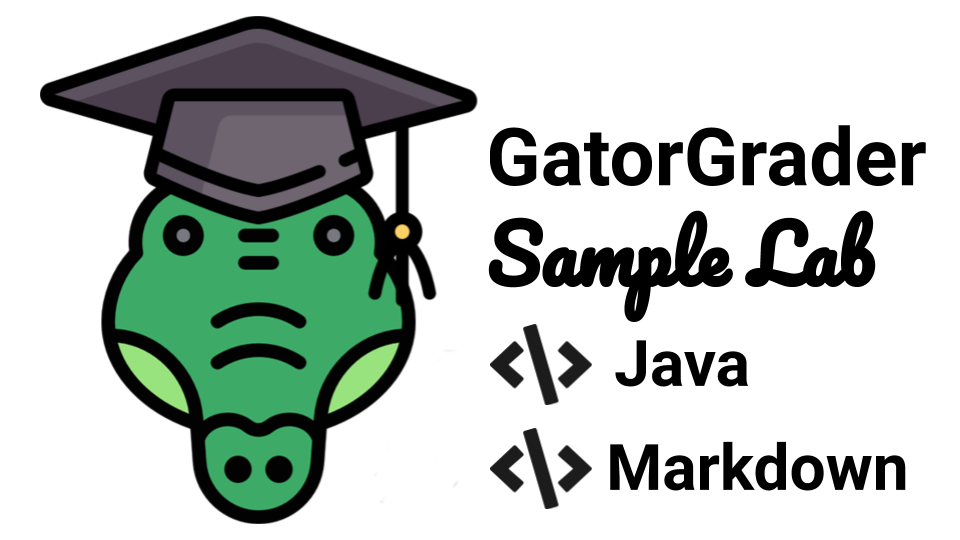

<!---

GatorGrader example that contains a solution to a Java programming:
https://github.com/GatorEducator/java-assignment-solution-100-01

This is companion "starter" repository (i.e., the repository given to students):
https://github.com/GatorEducator/java-assignment-starter-100-01

Learn more about GatorGrader and its supported checks by visiting this web site:
https://github.com/GatorEducator/gatorgrader

Problems? Raise an issue in the issue tracker for this assignment!

-->



<p align="center">
<b>
Automated assessment for an assignment on Java programming and technical writing in Markdown
</b>
</p>

# java-assignment-java-assignment-solution-100-01

## Table of Contents

* [Introduction](#introduction)
* [Learning](#learning)
* [Commands](#commands)
  * [Docker](#docker)
* [Output](#output)
* [Automated Checks with GatorGrader](#automated-checks-with-gatorgrader)
* [Updates](#updates)
* [Travis](#travis)
* [Requirements](#requirements)
* [Problems](#problems)
* [Assistance](#assistance)

## Introduction

Designed for use with [GitHub Classroom](https://classroom.github.com/) and
[GatorGrader](https://github.com/GatorEducator/gatorgrader/), this repository
contains the solution for a laboratory assignment in an introductory computer
science class that uses the Java programming language. The Travis CI builds for
this repository will pass, as evidenced by a green &#x2714; instead of a red
&#x2717; appearing in the commit logs. An instructor would use this repository
to create a "starter" repository with purposefully omitted features that a
student would create in order to achieve the stated learning objectives. Please
bear in mind that much of the content in this document is written in its current
form under the assumption that it will also accompany the "starter" repository
that an instructor shares with a student through the use of [GitHub
Classroom](https://classroom.github.com/).

This assignment requires a programmer to implement and test a Java program,
called `DisplayOutput`, that will produce four lines of output. The first line
of output will contain the name of the programmer and the date at which the
program was run. The next three lines of output will feature certain
one-sentence and one-line statements of declarations that the programmer would
like to provide to the person using the program. As verified by
[Checkstyle](https://github.com/checkstyle/checkstyle), the source code for the
`DisplayOutput.java` file must adhere to all of the requirements given in the
[Google Java Style Guide](https://google.github.io/styleguide/javaguide.html).

The programmer completing this assignment is also responsible for writing a
multiple-paragraph reflection, stored in the file `writing/reflection.md`, that
explains the challenges that you faced and the solutions you developed. This is
a Markdown file that should adhere to the standards described in the [Markdown
Syntax Guide](https://guides.github.com/features/mastering-markdown/). Remember,
an individual completing this assignment can preview the contents of a comitted
Markdown file by clicking on the name of the file in your GitHub repository.
Don't forget that your `writing/reflection.md` file should adhere to the
Markdown standards established by the [Markdown linting
tool](https://github.com/markdownlint/markdownlint) and, optionally, the writing
standards set by the [Proselint tool](http://proselint.com/).

The source code in the `DisplayOutput.java` file must also pass additional tests
set by the [GatorGrader tool](https://github.com/GatorEducator/gatorgrader). For
instance, GatorGrader will check to ensure that `DisplayOutput` produces exactly
four lines of output and that you correctly use the `new Date()` construct in
the Java code. When you use the `git commit` command to transfer your source
code to your GitHub repository, [Travis CI](https://travis-ci.com/) will
initialize a build of your assignment, checking to see if it meets all of the
requirements. If both your source code and writing meet all of the established
requirements, then you will see a green &#x2714; in the listing of commits in
GitHub. If your submission does not meet the requirements, a red &#x2717; will
appear instead. Please note that, at the option of the course instructor, some
checks may be run in Travis CI that are not run locally by the [GatorGrader
tool](https://github.com/GatorEducator/gatorgrader). Finally, the instructor
will reduce a programmer's grade for this assignment if the red &#x2717; appears
on the last commit in GitHub immediately before the assignment's due date.

A carefully formatted assignment sheet for this project provides more details
about the steps that a computer scientist should take to complete this
assignment. You can view this assignment sheet by visiting the listing of
laboratories on the course web site created by the course instructor. Please pay
attention to the icons in the left-hand margin of the assignment sheet as they
will help you to understand and remember what steps you should take at key parts
of the assignment.

## Continuous Learning

If you have not done so already, please read all of the relevant [GitHub
Guides](https://guides.github.com/) that explain how to use many of the features
that GitHub provides. In particular, please make sure that you have read the
following GitHub guides: [Mastering
Markdown](https://guides.github.com/features/mastering-markdown/), [Hello
World](https://guides.github.com/activities/hello-world/), and [Documenting Your
Projects on GitHub](https://guides.github.com/features/wikis/). Each of these
guides will help you to understand how to use both [GitHub](http://github.com) and
[GitHub Classroom](https://classroom.github.com/).

Students who want to learn more about how to use
[Docker](https://www.docker.com) should review the [Docker
Documentation](https://docs.docker.com/). Students are also encouraged to review
the documentation for their text editor, which is available for text editors
like [Atom](https://atom.io/docs) and [VS
Code](https://code.visualstudio.com/docs). You should also review the [Git
documentation](https://git-scm.com/doc) to learn more about how to use the Git
command-line client. In addition to talking with the instructor and technical
leader for your course, students are encouraged to search
[StackOverflow](https://stackoverflow.com/) for answers to their technical
questions.

If you are a student working to complete this assignment, you should also read
Chapters 1 and 2 in the course textbook, paying particularly close attention to
Sections 1.5 and 2.1. Please see the course instructor or one of the student
technical leaders if you have questions about any of these reading assignments.

## System Commands

This project invites students to enter system commands into a terminal window.
This assignment uses [Docker](https://www.docker.com) to deliver programs, such
as `gradle` and the source code and packages needed to run
[GatorGrader](https://github.com/GatorEducator/gatorgrader), to a students'
computer, thereby eliminating the need for a programmer to install them on their
development workstation. Individuals who do not want to install Docker can
optionally install of the programs mentioned in the [Project
Requirements](#requirements) section of this document.

### Using Docker

Once you have installed [Docker
Desktop](https://www.docker.com/products/docker-desktop), you can use the
following `docker run` command to start `gradle grade` as a containerized
application, using the [DockaGator](https://github.com/GatorEducator/dockagator)
Docker image available on
[DockerHub](https://cloud.docker.com/u/gatoreducator/repository/docker/gatoreducator/dockagator).

```bash
docker run --rm --name dockagator \
  -v "$(pwd)":/project \
  -v "$HOME/.dockagator":/root/.local/share \
  gatoreducator/dockagator
```

The aforementioned command will use `"$(pwd)"` (i.e., the current directory) as
the project directory and `"$HOME/.dockagator"` as the cached GatorGrader
directory. Please note that both of these directories must exist, although only
the project directory must contain something. Generally, the project directory
should contain the source code and technical writing of this assignment, as
provided to a student through GitHub. Additionally, the cache directory should
not contain anything other than directories and programs created by DockaGator,
thus ensuring that they are not otherwise overwritten during the completion of
the assignment. To ensure that the previous command will work correctly, you
should create the cache directory by running the command `mkdir
$HOME/.dockagator`. If the above `docker run` command does not work correctly on
the Windows operating system, you may need to instead run the following command
to work around limitations in the terminal window:

```bash
docker run --rm --name dockagator \
  -v "$(pwd):/project" \
  -v "$HOME/.dockagator:/root/.local/share" \
  gatoreducator/dockagator
```

Here are some additional commands that you may need to type when using Docker:

* `docker info`: display information about how Docker runs on your workstation
* `docker images`: show the Docker images installed on your workstation
* `docker container list`: list the active images running on your workstation
* `docker system prune`: remove many types of "dangling" components from your workstation
* `docker image prune`: remove all "dangling" docker images from your workstation
* `docker container prune`: remove all stopped docker containers from your workstation
* `docker rmi $(docker images -q) --force`: remove all docker images from your workstation

## Using Gradle

Since the above `docker run` command uses a Docker images that, by default, runs
`gradle grade` and then exit the Docker container, you may want to instead run
the following command so that you enter an "interactive terminal" that will
allow you to repeatedly run commands within the Docker container.

```bash
docker run -it --rm --name dockagator \
  -v "$(pwd)":/project \
  -v "$HOME/.dockagator":/root/.local/share \
  gatoreducator/dockagator /bin/bash
```

Once you have typed this command, you can use the [GatorGrader
tool](https://github.com/GatorEducator/gatorgrader) in the Docker container by
typing the command `gradle grade` in your terminal. Running this command will
produce a lot of output that you should carefully inspect. If GatorGrader's
output shows that there are no mistakes in the assignment, then your source code
and writing are passing all of the automated baseline checks. However, if the
output indicates that there are mistakes, then you will need to understand what
they are and then try to fix them.

You can also complete several important Java programming tasks by using the
`gradle` tool. For instance, you can compile (i.e., create bytecode from the
program's source code if it is a correct program) the program using the command
`gradle build`. Here are some other commands that you can type:

* `gradle grade`: run the [GatorGrader](https://github.com/GatorEducator/gatorgrader) tool to check your work
* `gradle clean`: clean the project of all the derived files
* `gradle check`: check the quality of the code using Checkstyle
* `gradle build`: create the bytecode from the Java source code
* `gradle run`: run the Java program in the command-line
* `gradle tasks`: display details about the Gradle system

To run one of these commands, you must be in the main (i.e., "home base")
directory for this assignment where the `build.gradle` file is located.

## Expected Program Output

Typing the command `gradle run` in the terminal window should produce the
following output for the completed version of `DisplayOutput`. As long as your
program adheres to all of the requirements for the assignment and passes all of
the verification checks, your version should produce similar output. With that
said, program output may vary according to, for instance, the name of the
programmer and the date on which you ran the program.

```
> Configure project :
Configured GatorGradle 0.4.4

> Task :compileJava UP-TO-DATE
> Task :processResources NO-SOURCE
> Task :classes UP-TO-DATE

> Task :run
Gregory M. Kapfhammer Sun Sep 08 22:29:56 GMT 2019
Hello World.
Gradle is Great.
Docker is Dynamite.

BUILD SUCCESSFUL in 1s
2 actionable tasks: 1 executed, 1 up-to-date
```

Running the command `gradle -q --console plain run` will suppress the display of
Gradle's diagnostic information and produce output like the following.

```
Gregory M. Kapfhammer Sun Sep 08 22:32:05 GMT 2019
Hello World.
Gradle is Great.
Docker is Dynamite.
```

## Automated Checks with GatorGrader

In addition to meeting all of the requirements outlined in the assignment sheet,
your submission must pass the following checks that
[GatorGrader](https://github.com/GatorEducator/gatorgrader) automatically
assesses:

- Repository has at least 10 commit(s)
- The DisplayOutput.java in src/main/java/labone has at least 2 multiple-line Java comment(s)
- The DisplayOutput.java in src/main/java/labone has at least 2 single-line Java comment(s)
- The DisplayOutput.java in src/main/java/labone has exactly 0 of the `Add Your Name Here` fragment
- The DisplayOutput.java in src/main/java/labone has exactly 0 of the `TODO` fragment
- The DisplayOutput.java in src/main/java/labone has exactly 1 match(es) of the `println\\((.)*\\)` regular expression
- The DisplayOutput.java in src/main/java/labone has exactly 1 of the `import java.util.Date` fragment
- The DisplayOutput.java in src/main/java/labone has exactly 1 of the `new Date()` fragment
- The command `gradle -q --console plain run` executes correctly
- The command `gradle build` executes correctly
- The command output has exactly 1 match(es) of the `Hello\\s+\\w+\\.(\\n)Gradle(\\s+\\w+)*\\.(\\n)Docker(\\s+\\w+)*\\.` regular expression
- The command output has exactly 4 lines
- The file DisplayOutput.java exists in the src/main/java/labone directory
- The file reflection.md exists in the writing directory
- The reflection.md in writing has at least 300 word(s) in total
- The reflection.md in writing has exactly 0 of the `Add Your Name Here` fragment
- The reflection.md in writing has exactly 1 of the `code_block` tag
- The reflection.md in writing has exactly 1 of the `list` tag
- The reflection.md in writing has exactly 3 of the `code` tag
- The reflection.md in writing has exactly 6 of the `heading` tag

## Downloading Project Updates

If GatorGrader's maintainers push updates too this sample assignment and you
received it through GitHub Classroom and you would like to also receive these
updates, then you can type this command in the main directory for this
assignment:

```
git remote add download git@github.com:GatorEducator/java-assignment-solution-100-01
```

You should only need to type this command once; typing the command additional
times may yield an error message but will not negatively influence the state of
your Git repository. Now, you are ready to download the updates provided by the
GatorGrader maintainers by typing this command:

```
git pull download master
```

This second command can be run whenever the maintainers needs to provide you
with new source code for this assignment. However, please note that, if you have
edited the files that the we updated, running the previous command may lead to
Git merge conflicts. If this happens, you may need to manually resolve them with
the help of the instructor or a student technical leader. Finally, please note
that the [Gradle plugin](https://github.com/GatorEducator/gatorgradle) for
[GatorGrader](https://github.com/GatorEducator/gatorgrader) will automatically
download the newest version of GatorGrader.

## Using Travis CI

This assignment uses [Travis CI](https://travis-ci.com/) to automatically run
[GatorGrader](https://github.com/GatorEducator/gatorgrader) and additional
checking programs every time you commit to your GitHub repository. The checking
will start as soon as you have accepted the assignment &mdash; thus creating your own
private repository &mdash; and the course instructor and/or GitHub enables Travis for
it. If you are using Travis for the first time, you will need to authorize
Travis CI to access the private repositories that you created on GitHub. If you
do not see either a yellow &#9679; or a green &#x2714; or a red &#x2717; in your
listing of commits, then please ask the instructor to see whether or not
Travis CI was correctly enabled.

## System Requirements

The GatorGrader software that supports the checking of this assignment was
developed for the following software and versions:

- Gradle 4.6
- Java 1.8.0
- MDL 0.4.0
- Proselint 0.8.0
- Python 3.6

## Reporting Problems

If you have found a problem with this assignment's provided source code, then
you can go to the [Computer Science 100 Lab 1
Starter](https://github.com/Allegheny-Computer-Science-100-F2018/cs100-F2018-lab1-starter)
repository and create an issue by clicking the "Issues" tab and then clicking
the green "New Issue" button. If you have found a problem with the [GatorGrader
tool](https://github.com/GatorEducator/gatorgrader) and the way that it checks
you assignment, then you can follow the aforementioned steps to create an issue
in its repository. To ensure that your issue is properly resolved, please
provide as many details as is possible about the problem that you experienced.
If you discover a problem with the laboratory assignment sheet, then please
raise an issue in the
[cs100-F2018-sheets](https://github.com/Allegheny-Computer-Science-100-F2018/cs100-F2018-sheets)
repository and mention this assignment.

Students who find &mdash; and use the appropriate GitHub issue tracker to
correctly document &mdash; a mistake in any aspect of this laboratory assignment
will receive free GitHub stickers and extra credit towards their grade for it.

## Receiving Assistance

If you are having trouble completing any part of this project, then please talk
with either the course instructor or a teaching assistant during the laboratory
session. Alternatively, you may ask questions in the Slack workspace for this
course. Finally, you can schedule a meeting during the course instructor's
office hours.
